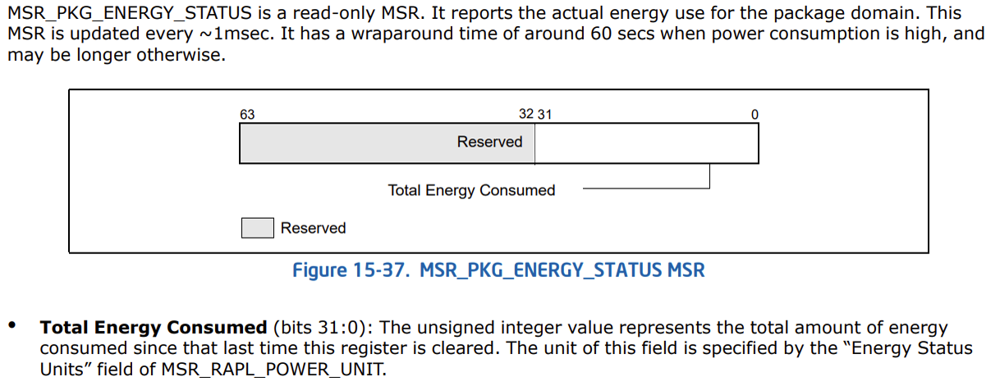
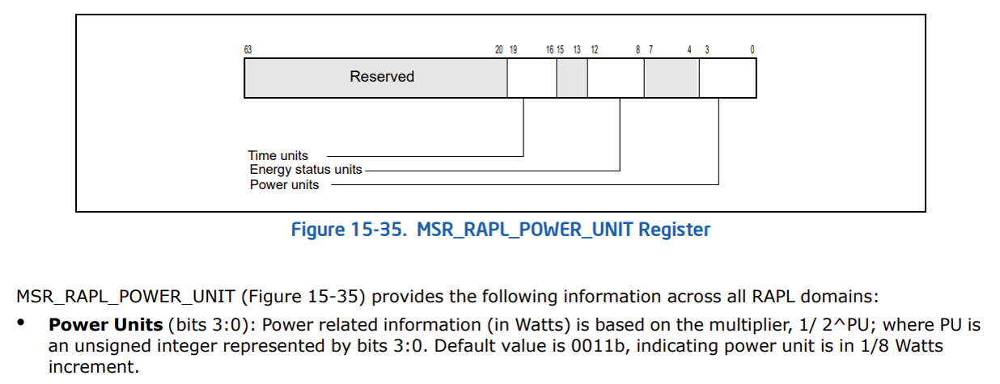

# intel_power_consumption_shell
A shell script working for Linux to read out power consumption based on Intel RAPL

# Prerequirests
You need to firstly install [msrtool](http://coreboot.org/Msrtool) that have rdmsr command that the shell script depends on.
Under Ubuntu you can easily install by command:
```
sudo apt install msr-tools
```

# Usage
Put rd_power.sh in your home directory, then simply run it as following command:
```
chmod +x ~/rd_power.sh & sudo ~/rd_power.sh
```
The result show you the power consumption value in watt(w).

# Theory
Calculating the difference between two values of **total_energy_millijoules** within a time interval (e.g, 1000ms)
then take the difference divided by the time interval to get the power consumption value (i.e, how many joules per second)
finally , the power consumption value should be multiplied by **power unit**

- **total_energy_millijoules**
  Associated with MSR_PKG_ENERGY_STATUS MSR. Value is read-only.
  Returns the actual energy use for the package domain in millijoules. The value is
  updated ~1msec. It has a wraparound time of around 60 secs when power consumption
  is high, and may be longer otherwise.
  
  

- **power unit**
  Power related information (in Watts) is based on the multiplier, 1/ 2^PU; where PU is
  an unsigned integer represented by bits 3:0. Default value is 0011b, indicating power unit is in 1/8 Watts
  increment.
  
  

# References
[Intel 64 and IA-32 Architechtures manual](https://www.intel.com/content/www/us/en/developer/articles/technical/intel-sdm.html)

[Intel-RAPL-via-Sysfs: Linux module - Sysfs entries for Running Average Power Limit interfaces ](https://github.com/razvanlupusoru/Intel-RAPL-via-Sysfs)

[intel_power_consumption_get: Linux - C program to get the power consumption for intel](https://github.com/lixiaobai09/intel_power_consumption_get/tree/master)
